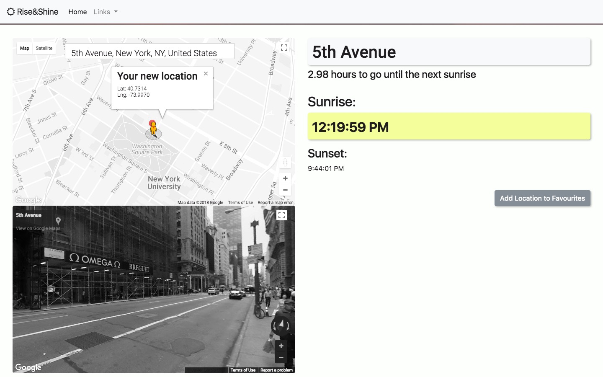

# sunriseAPI
Express/Node.js app with Webpack and MongoDB, connecting GoogleMaps API with SunriseSunset API

* User can search customised version of Google Map to find out time of sunrise (according to user's local time, determined by geolocation).

* App retrieves sunrise from SunriseSunset API, using the coordinates of the location searched for, and calculates in how many hours the next sunrise at that location will be, relative to user's location.

* User can add favourite searches to a MongoDB database for easy access, or delete when necessary.

* Google Maps Streetview included to give greater sense of location to searches.

